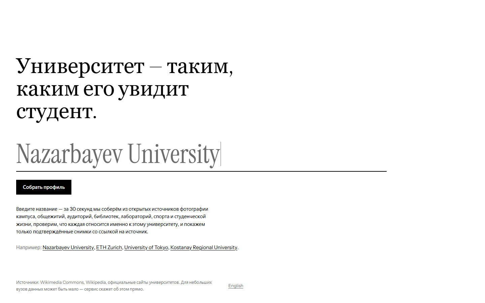
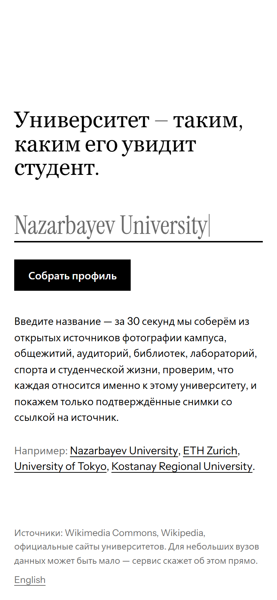
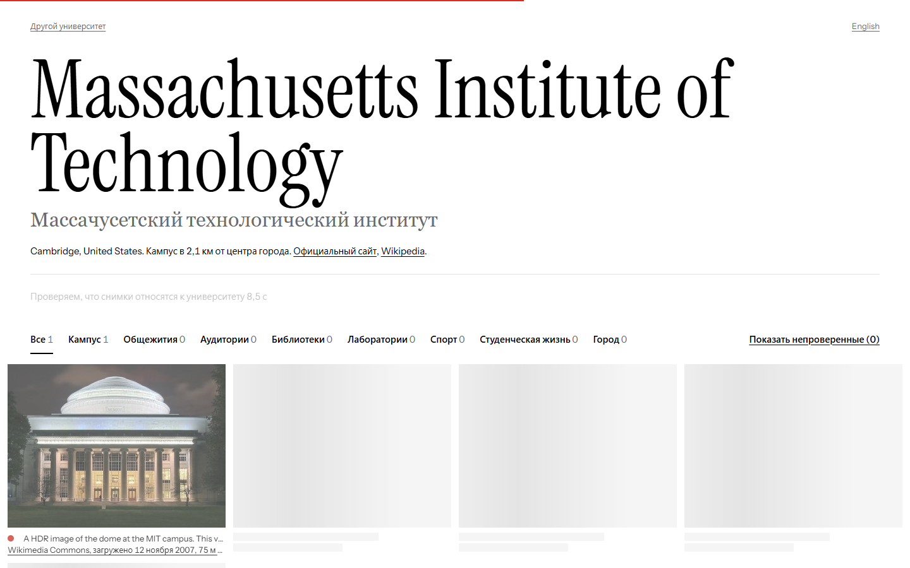
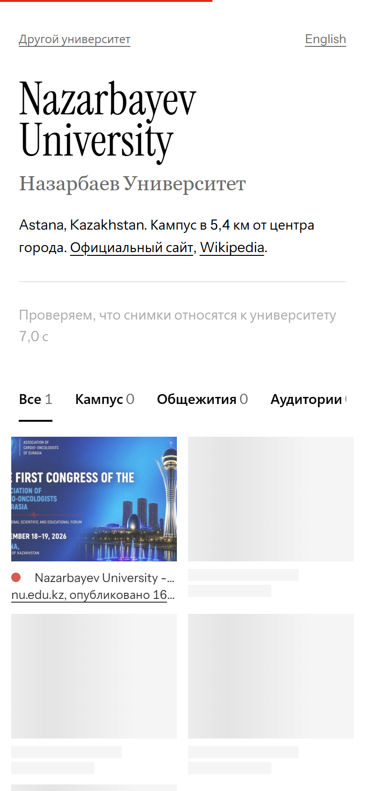
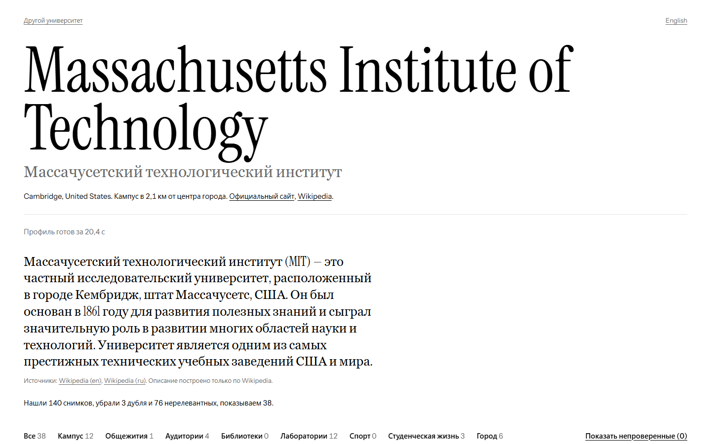
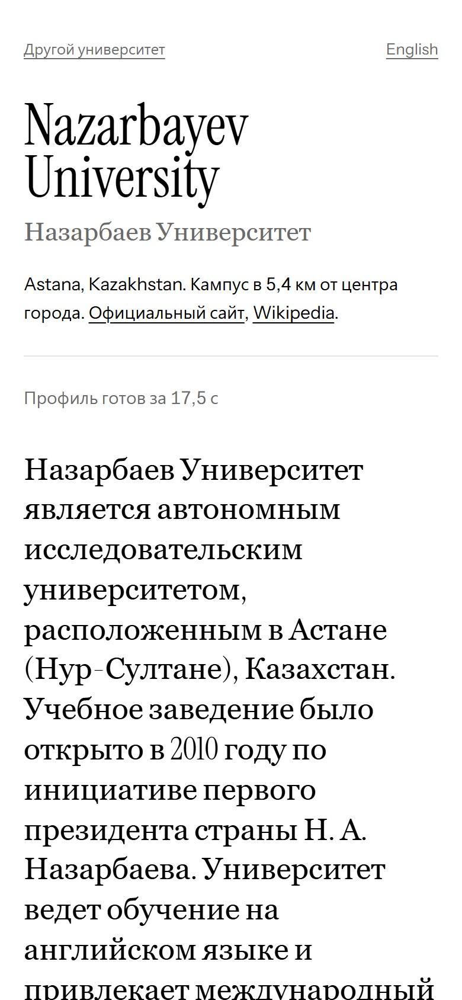
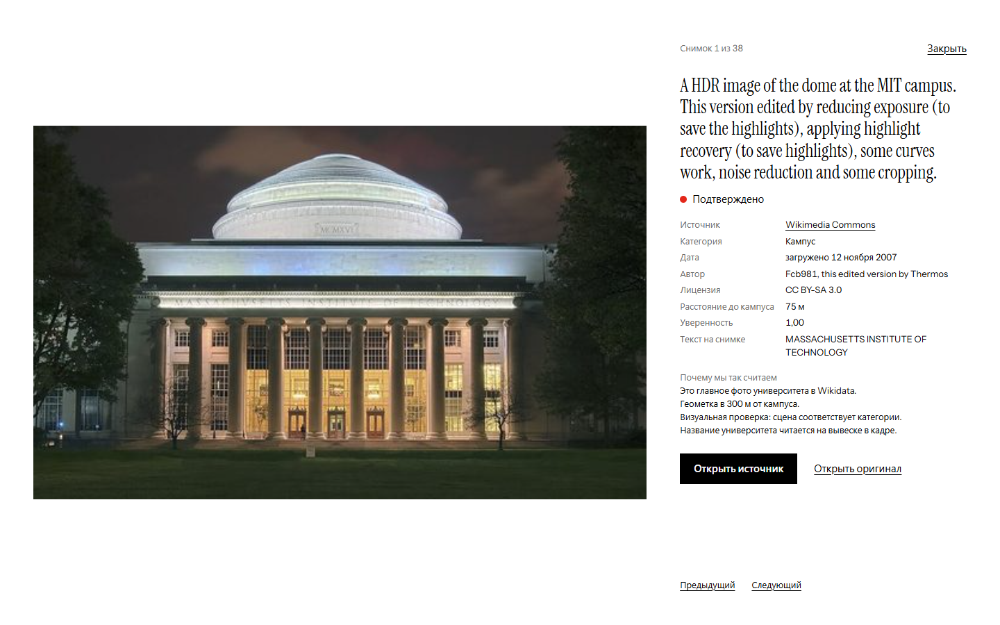
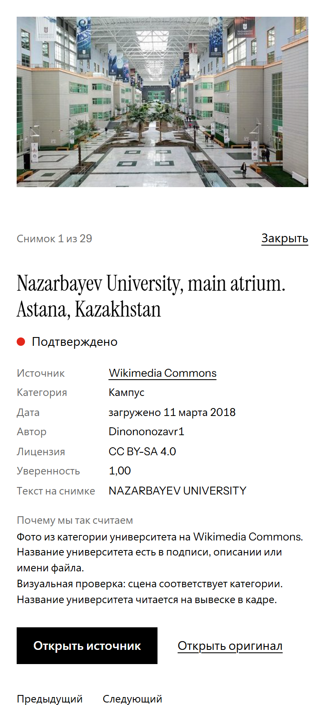
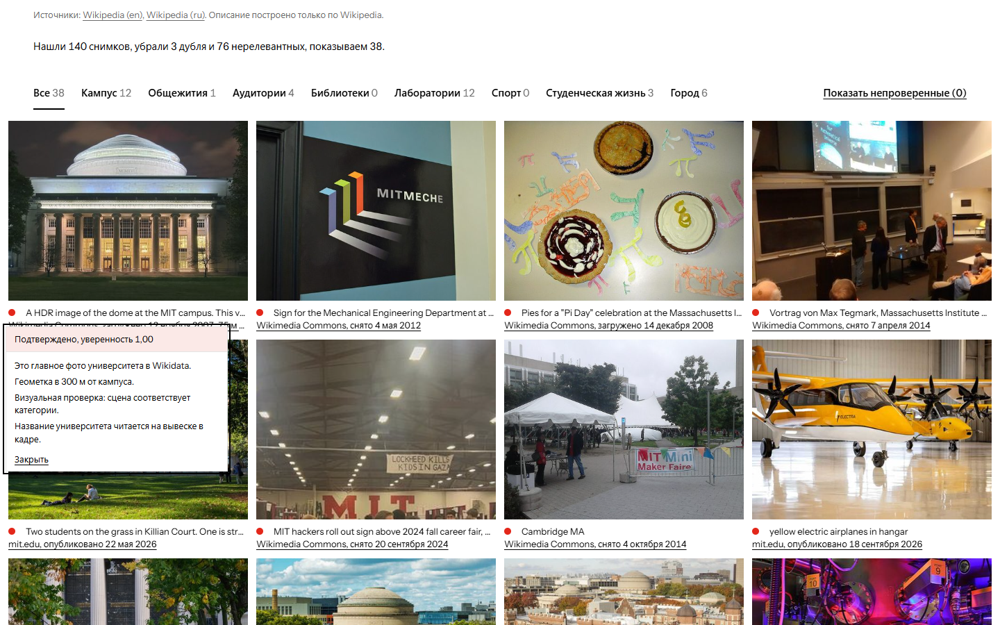
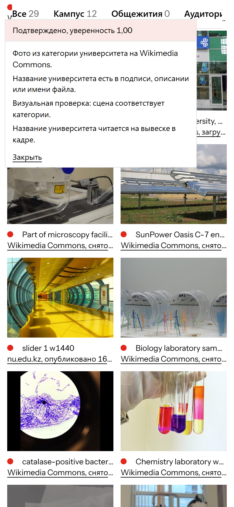

# Visual Campus

## 1. Задача
Разработать веб-сервис, который за 30 секунд собирает достоверный визуальный профиль любого университета мира. Пользователь вводит название вуза, а сервис находит фотографии кампуса, общежитий, аудиторий, библиотек и студенческой жизни. Главная сложность — отсеять нерелевантные и случайные кадры, гарантируя, что показанные изображения действительно относятся к выбранному учебному заведению. Пятнадцать проверенных и правильно отсортированных фотографий ценнее сотен случайных.

## 2. Решение
Visual Campus — это сервис, где честность важнее количества. Мы собираем данные из открытых источников и проводим их через строгий конвейер верификации.
Пользователь получает профиль с фотографиями, где каждое изображение имеет:
- Кликабельную ссылку на оригинальный источник
- Ярлык достоверности (Подтверждено, Вероятно, Не подтверждено) с объяснением причин
- Понятную категорию (Кампус, Библиотеки, Спорт и др.)
- Отметку о дате создания или публикации, без угадывания.

Все "неподтвержденные" фото скрыты по умолчанию. Если данных не хватает или какие-то этапы проверки не успели завершиться за 30 секунд — сервис честно сообщит об этом через предупреждения в UI.

### Интерфейс
Профиль свёрстан как «контактный лист»: крупный заголовок, одна строка статуса с прошедшими секундами, полноширинная сетка кадров, описание и карта. Строка категорий под шапкой — единственная навигация по профилю: «Все · Кампус · Общежития · Аудитории · Библиотеки · Лаборатории · Спорт · Студенческая жизнь · Город». Пункты **«Общежития», «Спорт», «Лаборатории» и «Студенческая жизнь»** — это четыре фильтра из условия кейса; остальные пункты — категории, которые различает конвейер. Строка закреплена при прокрутке, в её конце — переключатель «Показать непроверенные (N)».

Каждый кадр подписан одинаково: метка достоверности (красная точка — «Подтверждено», контур — «Вероятно», пунктир — «Не подтверждено»), название снимка и подчёркнутая ссылка на страницу источника с датой («Wikimedia Commons, снято 4 мая 2019»). Нажатие на метку открывает список причин оценки, нажатие на снимок — просмотр с полными метаданными и ссылками «Открыть источник» и «Открыть оригинал». Кадры «проявляются» из чёрно-белого в цвет по мере прихода из потока; при системной настройке «уменьшить движение» анимации нет. Все элементы управления доступны с клавиатуры (стрелки в строке категорий и в просмотре, Escape закрывает окна).

### Скриншоты
Сняты скриптом `frontend/scripts/ui_gate.mjs` на холодном запуске: десктоп 1440×900 (Massachusetts Institute of Technology) и мобильный 390×844 (Nazarbayev University). В том же запуске шапка появилась через 1,6 с, первые кадры — через 8,4 с, профиль был готов за 20,4 с (мобильный: 1,1 с / 6,8 с / 17,6 с).

| | Десктоп | Мобильный |
|---|---|---|
| Главная |  |  |
| Поток: кадры проявляются |  |  |
| Готовый профиль |  |  |
| Просмотр снимка |  |  |
| Причины оценки |  |  |

Ещё один снимок, `docs/screenshots/desktop-reduced-motion.png`, сделан с включённым `prefers-reduced-motion`: кадры показаны сразу, без проявления.

## 3. Стек
- **Backend:** Python 3.11+, FastAPI, Uvicorn, SSE-Starlette, HTTPX, Pydantic, Pillow, ImageHash, BeautifulSoup4, Gemini API (через google-genai), aiosqlite.
- **Frontend:** React 18, TypeScript, Vite, Tailwind CSS 4, Motion, React-Leaflet, шрифты Instrument Serif и Instrument Sans (@fontsource).
- **Проверки:** pytest, ruff, Playwright (скрипт Gate B поверх установленного Edge).
- **Инфраструктура:** Docker (единый образ с бэкендом и фронтендом).

## 4. Архитектура
Конвейер сбора и обработки профиля работает параллельно и ограничен жестким дедлайном (30 секунд).
`Старт -> A -> B (вкл. B2) -> C -> D -> E -> F -> G -> H -> I -> Готово`

- **Stage A (resolve):** Поиск QID университета в Wikidata, загрузка названий, алиасов, координат и определение города (до 4 прыжков по P131). Параллельно скачиваются выдержки из Wikipedia. (Жёсткий лимит 5 с).
- **Stage B (collect):** Параллельный опрос источников: Wikidata, Wikimedia Commons (категория, подкатегории, поиск, гео), категория города на Commons, официальный сайт (парсинг HTML). (Бюджет 8 с на источник, 6 с на страницу). Первая волна загрузки стартует уже через 2 с — с кандидатами от источников, которые успели ответить; остальные источники продолжают работать, их кандидаты попадают во вторую волну.
- **Stage B2 (web_search):** Опциональный поиск по Google CSE (если включен в `.env`), запускается только если не хватает кандидатов (менее 12 шт).
- **Stage C (normalize):** Дедупликация URL и обрезка лимитов (120 кандидатов, до 20 городских). (Почти мгновенно).
- **Stage D (download):** Асинхронное скачивание двумя волнами: сначала 16 лучших кандидатов (лимит 4 с), затем остальные (лимит 8 с). До 16 параллельных загрузок, к хостам Wikimedia — не более 8 одновременно, 6 с на одно изображение. Валидация, расчет sha1 и pHash, сохранение миниатюр (JPEG 512px).
- **Stage E (dedup):** Группировка дубликатов с помощью алгоритма Union-Find по sha1 и pHash. Оставляется только лучший представитель.
- **Stage F (vision):** Пакетная классификация изображений моделью Gemini: по 12 фото в пакете, до 6 пакетов одновременно; первый пакет — 4 фото, чтобы первые кадры появились раньше. Если основная модель отвечает 429 (у бесплатного тарифа 15 запросов в минуту на модель), пакет уходит на резервную модель (`VISION_FALLBACK_MODEL`). Перед стартом пакета проверяется таймер — если времени меньше 4 сек, пакет отменяется. (Бюджет 20 с на пакет).
- **Stage G (score):** Детерминированный расчет доверия на основе источника, метаданных (совпадение имени), геопозиции (до 300 м / 1 км) и ответа Vision-модели.
- **Stage H (describe):** Генерация краткого описания с помощью Gemini. Работает параллельно со Stage F. (Лимит 12 с).
- **Stage I (finalize):** Применение кап-лимитов для выдачи (45 показанных, до 15 скрытых), расчет статистики, формирование предупреждений и кэширование профиля (aiosqlite). Профиль без единого показанного фото не кэшируется.

## 5. Инструкция запуска
Для запуска проекта вам понадобится только Docker и `.env` файл.
Единственный необходимый API ключ — `GEMINI_API_KEY` (бесплатный от Google AI Studio).

1. Склонируйте репозиторий:
   `git clone ... && cd visual-campus`
2. Скопируйте пример окружения:
   `cp .env.example .env`
3. Откройте `.env` и вставьте ваш `GEMINI_API_KEY` и `CONTACT_EMAIL`. Адрес должен быть настоящим: он уходит в User-Agent запросов к Wikimedia, а с адресом-заглушкой CDN Wikimedia отдаёт оригиналы файлов с ошибкой 403 (сервис в этом случае переходит на миниатюры 500 px, но качество кадров ниже).
4. Запустите через Docker:
   `docker-compose up --build`
5. Откройте `http://localhost:8000` в браузере.

Для локальной разработки:
`cd backend && pip install -r requirements.txt && uvicorn app.main:app`
В другом терминале: `cd frontend && npm install && npm run dev` (Фронтенд запустится на порту 5173 с проксированием `/api` на 8000).
Чтобы отдавать всё с одного порта, как в Docker-образе, соберите фронтенд (`npm run build`) и скопируйте `frontend/dist` в `backend/app/static`.

## 6. Тестовый сценарий
1. Введите три разных университета (например, один из которых отсутствует в демо-видео). Ожидаемый результат: шапка профиля появляется в первые секунды, кадры проявляются по мере проверки, строка статуса под шапкой показывает прошедшее время и заканчивается на «Профиль готов за N с» раньше 30 с.
2. Введите название с опечаткой (например, "Massachusets Institut"). Ожидаемый результат: сервис автоматически исправит название и покажет результаты для "Massachusetts Institute of Technology", о чем появится уведомление «Показаны результаты по исправленному названию».
3. Откройте 5 случайных фотографий. Ожидаемый результат: под каждым кадром — подчёркнутая ссылка на страницу источника с датой, в просмотре снимка — «Открыть источник» и «Открыть оригинал»; каждая ссылка приведет на реальную страницу, содержащую данное фото.
4. Проверьте вкладку пустой категории (например, если нет фото библиотек). Ожидаемый результат: честное сообщение «В открытых источниках не нашлось проверенных фото по категории «Библиотеки».».
5. (Опционально) Сделайте один источник недоступным (например, заблокируйте хост `commons.wikimedia.org` в файле hosts). Ожидаемый результат: профиль построится из остальных источников с предупреждением «Источник … сейчас недоступен, профиль собран без него». Отключение источника через `DISABLE_SOURCES` в `.env` — осознанная настройка, она предупреждения не даёт.
6. Перезагрузите страницу профиля. Ожидаемый результат: профиль отдастся из кэша мгновенно (<1с), в шапке появится строка «Собрано N минут назад. Обновить», а строка статуса — «Профиль собран … и показан из кэша». Нажмите «Обновить», и профиль пересоберется с нуля.

Автоматические проверки:
- `cd backend && pytest -q` и `ruff check .` — тесты бэкенда (517) и линтер.
- `cd backend && python ../scripts/diagnose.py "Al-Farabi Kazakh National University"` — таблица по стадиям конвейера для одного университета (кандидаты по источникам, загрузки, дубли, пакеты Vision, ярлыки) и все пойманные исключения.
- `python scripts/eval.py` — прогон списка `scripts/universities.txt` через запущенный сервер, результат в `EVAL.md`.
- `cd frontend && node scripts/ui_gate.mjs --base http://127.0.0.1:8000` — Gate B: тайминги холодного запуска, строка категорий, подписи кадров, клавиатура, режим без анимации, скриншоты в `docs/screenshots/`.

## 7. Роли команды
- <Имя — Backend-разработчик>
- <Имя — Frontend-разработчик>
- <Имя — AI-инженер/Парсинг>

## 8. Источники данных
| Источник | Что берем | Как формируется ссылка | Дата | Лицензия | Ограничения |
|----------|----------|------------------------|------|----------|-------------|
| **Wikidata** | P18 (главное фото), логотип, координаты, ссылки | URL из P18/P154 | Дата неизвестна | Из Commons | Данных мало |
| **Официальный сайт** | Изображения с главной страницы и до 6 внутренних страниц | Оригинальная страница, где найдено фото (URL) | Дата публикации (meta tags/headers) | — | Соблюдается robots.txt; SPA сайты сложно парсить, могут быть стоки |
| **Wikimedia Commons** | Категория университета, подкатегории (кампус, общежития), поиск | Ссылка на страницу File:... | Дата создания (EXIF) или загрузки | Берется из метаданных | Фотографии могут устареть или быть низкого качества |
| **Commons Geo** | Поиск фото в радиусе 1 км от координат кампуса | Ссылка на страницу File:... | Дата создания (EXIF) | Из метаданных | Могут попасть нерелевантные городские объекты |
| **Google CSE** | Веб-поиск (опционально) | Ссылка контекста (contextLink) | Дата неизвестна | — | Низкий вес доверия (только Вероятно), лимит 100 запросов/день |

## 9. AI / API
Проект использует Gemini (бесплатный тариф) для двух задач:
1. **Зрение (Vision):** `gemini-3.5-flash-lite` получает батч из 12 картинок, определяет, является ли фото кампусом (а не картой, логотипом и т.д.), читает текст на вывесках и классифицирует категорию. Когда основная модель исчерпывает минутную квоту, батч уходит на резервную `gemini-3.1-flash-lite` (`VISION_FALLBACK_MODEL`). Модель не может дать статус "Подтверждено" самостоятельно — это делает детерминированный алгоритм.
2. **Текст (Text):** Та же модель генерирует короткое саммари по университету (используя ТОЛЬКО скачанные тексты из Википедии и сайта), а также исправляет опечатки при нулевой выдаче в поиске.

Промпты находятся в `backend/app/ai/prompts.py`.

## 10. Готовые компоненты
- **FastAPI / Uvicorn:** Асинхронный веб-сервер бэкенда.
- **Pydantic:** Валидация данных и схемы (settings).
- **Pillow / ImageHash:** Изменение размера фото, вычисление pHash.
- **BeautifulSoup4 / lxml:** Парсинг HTML официальных сайтов.
- **google-genai:** SDK для взаимодействия с Gemini API.
- **React / Vite:** Фреймворк фронтенда.
- **Tailwind CSS 4:** Стилизация; токены дизайна (цвета, шрифты, отступы) заданы в `frontend/src/tokens.css`.
- **Motion (framer-motion) 13.4:** Проявление кадров, подчёркивание активной категории, общий слой снимка между сеткой и просмотром; учитывает `prefers-reduced-motion`.
- **Instrument Serif / Instrument Sans (@fontsource 5.3):** Заголовки и текст, шрифты лежат в сборке (без внешних запросов). Файлы содержат только латиницу — кириллица набирается системными Georgia / system-ui.
- **React-Leaflet:** Отображение карты и координат (тайлы OpenStreetMap, обесцвечены через CSS).
- **Playwright 1.63 (только для разработки):** Скрипт Gate B `frontend/scripts/ui_gate.mjs`, работает через установленный Edge, браузеры не скачивает.

## 11. Ограничения
- **Покрытие:** Зависит от Wikidata, Commons и официальных сайтов. Если вуз маленький и не представлен там, профиль будет скудным.
- **SPA сайты:** Сайты, где контент рендерится исключительно через JavaScript (без SSR), могут отдавать мало картинок, так как мы не используем headless браузер.
- **Гео-шум:** При поиске геотегов рядом с кампусом часто попадают случайные городские сцены, если кампус интегрирован в городскую среду.
- **Стоковые фото:** Официальные сайты иногда используют стоковые фотографии, отфильтровать которые на 100% сложно.
- **Холодный старт:** Развертывание на платформах с режимом сна (Render free) может добавлять 30–50 секунд к первому запуску сервиса.
- **Лимиты API:** Жесткий тайм-менеджмент (30 сек) может обрывать анализ для последних батчей картинок; при нескольких профилях подряд минутная квота Gemini (15 запросов на модель) заставляет часть батчей ждать или уходить на резервную модель.
- **Шрифты:** Instrument Serif и Instrument Sans не содержат кириллицы, поэтому русский текст набирается системными шрифтами.

## 12. Методы проверки
Уровень доверия (confidence) высчитывается по следующей таблице, базовая ставка зависит от источника:

| Источник | Базовый балл |
|----------|--------------|
| Wikidata P18 | 0.60 |
| Официальный сайт | 0.55 |
| Категория Commons | 0.55 |
| Commons Geo / Город | 0.40 |
| Commons Поиск | 0.25 |
| Веб-поиск (Google) | 0.15 |

**Бонусы:**
- `+0.20`: Название университета найдено в метаданных файла (title, alt, filename).
- `+0.20`: Геометка в радиусе 300 м (`+0.10` если в радиусе 1 км).
- `+0.15`: Визуальная проверка подтвердила, что это фото кампуса.
- `+0.15`: Название вуза читается на вывеске в кадре.

**Пороги:**
- `>= 0.70` — Подтверждено (verified)
- `>= 0.40 и < 0.70` — Вероятно (likely)
- `< 0.40` — Не подтверждено (unverified, скрыто по умолчанию)
*(Фото с веб-поиска или те, где Vision не справился, физически не могут стать "Подтверждено".)*

## 13. Развитие
В будущих версиях можно реализовать:
- Интеграцию дополнительных плагинов-источников (например, VK, Telegram-каналы).
- Сравнение двух университетов бок о бок.
- Подключение агрегации отзывов студентов.
- Использование headless-браузера (Playwright) для более надежного парсинга SPA-сайтов (в фоне).
